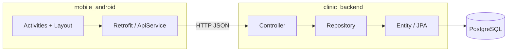

# Kiến trúc, cấu trúc và logic hiện tại — PhongKham

Tài liệu mô tả trạng thái **thực tế** của mã nguồn trong workspace (đọc từ `clinic_backend`, `mobile_android`). Không phải kế hoách tương lai trừ khi ghi rõ là *chưa làm*.

---

## 1. Tổng quan hệ thống

- **Backend:** một ứng dụng **Spring Boot 3.2.4**, **Java 17**, **monolith** (một artifact Maven `clinic`), REST API, **PostgreSQL**, **Spring Data JPA** (`ddl-auto: update`), **Spring Security** (cấu hình tối thiểu).
- **Mobile:** ứng dụng **Android** (Java), giao tiếp HTTP qua **Retrofit 2** + Gson, màn hình **Đăng nhập / Đăng ký** và **Main** (placeholder).
- **Phân tách vai trò:** server là nguồn dữ liệu & nghiệp vụ; app chỉ là client (View + gọi API). Không có microservice.



---

## 2. Cấu trúc thư mục workspace

```
PhongKham/
├── clinic_backend/     # Spring Boot API
├── mobile_android/     # App Android
├── docs/               # (hiện trống)
└── prod/               # Tài liệu kiến trúc / trạng thái dự án (file này)
```

---

## 3. Backend (`clinic_backend`)

### 3.1. Stack kỹ thuật (theo `pom.xml`)

| Thành phần | Ghi chú |
|------------|---------|
| spring-boot-starter-web | REST |
| spring-boot-starter-data-jpa | ORM |
| spring-boot-starter-security | JWT filter, BCrypt, permit auth/checkin/templates; còn lại authenticated |
| spring-boot-starter-validation | Có dependency; có thể dùng `@Valid` trên controller |
| postgresql | Driver runtime |
| lombok | Entity/DTO/Controller |
| jjwt 0.11.5 | Đã dùng: `JwtService` ký/verify, `JwtAuthenticationFilter` đọc Bearer token |

**Cấu hình runtime:** `src/main/resources/application.yml` — datasource `jdbc:postgresql://localhost:5432/phongkham`, user `postgres`, JPA `show-sql`, dialect PostgreSQL.

### 3.2. Cấu trúc package Java (`com.hcmute.clinic`)

| Package | Vai trò hiện tại |
|---------|------------------|
| *(root)* | `ClinicApplication` — entry point |
| `config` | `SecurityConfig`, `SeedDataLoader`, `AdminSeedRunner`; `@EnableMethodSecurity` |
| `controller` | `AuthController`, `CheckInController`, `PatientController`, `TreatmentPlanController`, `TreatmentPlanTemplateController`, `DoctorController`, `AdminDoctorController`, `QueueController`, `ClinicRoomController`, `NotificationController`, `ReceptionController` |
| `service` | `OtpService`, `CheckInQueueService`, `TreatmentPlanService`, `AdminDoctorService`, `ScanLogService` |
| `dto` | `LoginRequest`, `RegisterRequest`, `AuthResponse`, `OtpRequestDto`, `CreateDoctorRequest`, `CheckInScanRequest`, v.v. |
| `repository` | `PatientRepository`, `DoctorRepository`, `AdminRepository`, `OtpChallengeRepository`, `CheckInQueueRepository`, `AppointmentRepository`, `TreatmentPlanTemplateRepository`, `ClinicRoomRepository`, `NotificationRepository`, `ScanLogRepository`, v.v. |
| `security` | `JwtService`, `JwtAuthenticationFilter` |
| `entity` | Toàn bộ mô hình JPA (Patient, Doctor, Admin, OtpChallenge, CheckInQueue, TreatmentPlanTemplate, Notification, ScanLog, v.v.) |
| `enums` | `QueueStatus` (WAITING, IN_PROGRESS, PAUSED_FOR_TEST, RETURNED_PRIORITY, COMPLETED, SKIPPED), `OtpPurpose`, `UiTemplateType` (GENERAL, SURGERY, ORTHO, IMPLANT, PERIO), v.v. |
| `exception` | `GlobalExceptionHandler` — ResponseStatusException, AccessDeniedException, validation, generic |

**Khi triển khai auth / admin:** xem cây file đề xuất theo đúng MVC monolith trong [`PLAN_AUTH_UI_VA_VAI_TRO.md`](./PLAN_AUTH_UI_VA_VAI_TRO.md) — **mục 2. Cấu trúc file theo kiến trúc dự án**.

### 3.3. Mô hình người dùng (kế thừa)

- `User` là `@MappedSuperclass`: `id`, `email`, `passwordHash`, `firstName`, `lastName`, `avatarUrl`, `isActive`, `createdAt`.
- Ba thực thể cụ thể (mỗi loại một bảng riêng, cột lặp lại các field của `User` theo kiểu mapped superclass):
  - **`Patient`** — thêm `phone`, `dob`, `gender`, `address`, `rewardPoints`, `qrCodeData`; quan hệ `OneToOne` tới `PatientProfile`.
  - **`Doctor`** — thêm `ClinicRoom` (optional), `specialization`, `licenseNumber`, `biography`, `experienceYears`.
  - **`Admin`** — hiện không thêm field riêng.

### 3.4. Mô hình nghiệp vụ chính (entity — tóm tắt quan hệ)

Phòng khám được mô hình hóa xung quanh **bệnh nhân**, **lịch hẹn**, **phòng**, **dịch vụ**, **hồ sơ / đơn thuốc**, **kế hoạch điều trị nhiều bước**, **hàng đợi**, **thanh toán**, **đánh giá**, **thông báo**.

| Nhóm | Entity | Ý nghĩa nghiệp vụ |
|------|--------|-------------------|
| Danh mục | `ServiceCategory` → `Service` | Nhóm dịch vụ; mỗi `Service` có giá, thời lượng, cờ `active` (cột `is_active`) |
| Địa điểm | `ClinicRoom` | Phòng khám; `Doctor` có thể gắn phòng |
| Lịch | `Appointment` | Bệnh nhân + bác sĩ + dịch vụ, giờ hẹn, `BookingType` (ONLINE / WALK_IN), `AppointmentStatus`, optional `planStepId` liên kết bước kế hoạch |
| Hàng đợi | `CheckInQueue` | Một-một với `Appointment`; gắn `ClinicRoom`, optional `TreatmentPlanStep`; số thứ tự, `QueueStatus`, mức ưu tiên |
| Hồ sơ | `MedicalRecord` | Gắn `Appointment`, `Patient`, `Doctor`; chẩn đoán, triệu chứng, sinh hiệu, lời khuyên; chi tiết `MedicalRecordDetail` (có trường `toothNumber` — gợi ý nha khoa); một-một `Prescription` |
| Đơn thuốc | `Prescription`, `PrescriptionDetail` | Thuốc, liều, tần suất, thời gian, đơn vị |
| Kế hoạch điều trị | `TreatmentPlan` | Thuộc `Patient`, optional `MedicalRecord`, `TreatmentPlanStatus`, danh sách `TreatmentPlanStep` |
| Bước điều trị | `TreatmentPlanStep` | Thuộc plan + `Service`, optional `ClinicRoom`, `appointmentId` (Long, tránh vòng JPA), `StepStatus`, giá thực tế, kết luận BS, ảnh `StepImage` |
| Tài chính | `Invoice` | `Patient`, optional `TreatmentPlan` / `MedicalRecord`, tổng tiền, giảm giá, đã trả, còn lại, `InvoiceStatus`; `Payment` nhiều-một |
| Đánh giá | `ServiceReview` | Bệnh nhân, optional bác sĩ / hồ sơ / dịch vụ / lịch hẹn, điểm, bình luận |
| Thông báo | `Notification` | Gửi cho `Patient`: tiêu đề, nội dung, loại, `isRead` |
| Hồ sơ sức khỏe | `PatientProfile` | Dị ứng, bệnh nền, nhóm máu, ghi chú; `last_updated` |
| Nhật ký quét | `ScanLog` | Mã QR, statusCode, errorMessage — lưu khi quét thất bại |

**Lưu ý:** `Service` có thêm `ui_template_type` (enum UiTemplateType) cho form chuyên sâu Phase E.

### 3.5. Enum (trạng thái)

| Enum | Giá trị |
|------|---------|
| `AppointmentStatus` | SCHEDULED, CONFIRMED, COMPLETED, CANCELLED, NO_SHOW |
| `BookingType` | ONLINE, WALK_IN |
| `QueueStatus` | WAITING, IN_PROGRESS, PAUSED_FOR_TEST, RETURNED_PRIORITY, COMPLETED, SKIPPED |
| `StepStatus` | PENDING, IN_PROGRESS, COMPLETED, SKIPPED |
| `TreatmentPlanStatus` | IN_PROGRESS, COMPLETED, CANCELLED |
| `InvoiceStatus` | UNPAID, PARTIAL, PAID, CANCELLED |
| `PaymentStatus` | SUCCESS, FAILED, PENDING |

### 3.6. API đang chạy

**Auth** (`/api/auth`):

| Method | Path | Hành vi |
|--------|------|---------|
| POST | `/login` | Patient: email+password, BCrypt verify → JWT (role PATIENT) |
| POST | `/staff/login` | Doctor/Admin: email+password → JWT (role DOCTOR/ADMIN) |
| POST | `/register` | Patient: email+password, BCrypt hash, tạo qrCodeData `patient:{id}` |
| POST | `/otp/request` | Gửi OTP (LOGIN/REGISTER) — dev: log console |
| POST | `/otp/verify` | Verify OTP, trả JWT nếu đã có tài khoản hoặc `needsRegistration` |

**Check-in** (`/api/checkin`):

| Method | Path | Hành vi |
|--------|------|---------|
| POST | `/scan` | Body `{qrData}` — nhận `patient:id` hoặc JWT QR; validate, tạo CheckInQueue, gửi Notification; lưu lỗi vào ScanLog nếu thất bại |
| GET | `/qr-token` | JWT PATIENT — sinh QR token JWT 3 phút cho app bệnh nhân (dynamic QR) |

**Patient** (`/api/patients`, JWT PATIENT):

| Method | Path | Hành vi |
|--------|------|---------|
| GET | `/me` | Thông tin bệnh nhân + qrCodeData |
| GET | `/me/checkin-status` | Trạng thái check-in hôm nay (queueNumber, roomName, status, hint) |
| GET | `/me/appointments/upcoming` | Lịch hẹn sắp tới (SCHEDULED/CONFIRMED) |

**Treatment plans** (`/api/treatment-plans`):

| Method | Path | Hành vi |
|--------|------|---------|
| GET | (public) `/api/treatment-templates` | Danh sách mẫu phác đồ |
| POST | `/from-template` | Tạo plan từ template (JWT), gửi Notification |
| GET | `/my` | Danh sách plan của patient (JWT PATIENT) |
| GET | `/{id}` | Chi tiết plan (JWT DOCTOR/ADMIN) |
| PUT | `/{id}` | Cập nhật steps của plan (JWT DOCTOR/ADMIN) |

**Doctor** (`/api/doctor`, JWT DOCTOR/ADMIN):

| Method | Path | Hành vi |
|--------|------|---------|
| GET | `/patient?qr=...` | Tra cứu bệnh nhân theo QR (patient:id hoặc JWT) |

**Queue** (`/api/queue`, JWT DOCTOR/ADMIN):

| Method | Path | Hành vi |
|--------|------|---------|
| GET | `/room/{roomId}` | Danh sách hàng đợi phòng |
| PUT | `/{id}/status` | Cập nhật trạng thái queue |
| POST | `/{id}/call` | Gọi bệnh nhân vào phòng (IN_PROGRESS) |
| POST | `/{id}/transfer-xray` | Chuyển đi chụp X-Quang (PAUSED_FOR_TEST) |
| POST | `/{id}/complete-xray` | Hoàn thành X-Quang → RETURNED_PRIORITY |

**Clinic rooms** (`/api/clinic-rooms`, JWT):

| Method | Path | Hành vi |
|--------|------|---------|
| GET | `/` | Danh sách phòng khám |

**Notifications** (`/api/notifications`, JWT PATIENT):

| Method | Path | Hành vi |
|--------|------|---------|
| GET | `/me` | Danh sách thông báo |
| PATCH | `/{id}/read` | Đánh dấu đã đọc |

**Reception** (`/api/reception`, JWT DOCTOR/ADMIN):

| Method | Path | Hành vi |
|--------|------|---------|
| GET | `/scan-logs?limit=50` | Nhật ký quét QR lỗi 24h qua |

**Admin** (`/api/admin/doctors`, JWT ADMIN):

| Method | Path | Hành vi |
|--------|------|---------|
| POST | `/` | Tạo tài khoản Doctor (email, password BCrypt, firstName, lastName, specialization, clinicRoomId) |

**Static (permit):** `scanner.html`, `queue.html`, `doctor.html`, `reception.html`, `scan-logs.html`, `odontogram.html`. Queue dùng SSE real-time (`/api/queue/stream/room/{id}`).

**Spring Security:** JWT filter đọc `Authorization: Bearer <token>`; permit `/api/auth/**`, `/api/checkin/scan`, `/api/treatment-templates`, các trang .html; còn lại `authenticated`; `@PreAuthorize` cho Admin, Doctor.

---

## 4. Mobile (`mobile_android`)

### 4.1. Cấu trúc mã nguồn chính

| Vị trí | Nội dung |
|--------|----------|
| `app/src/main/java/.../ui/activities/` | `WelcomeActivity` (launcher), `PhoneLoginActivity`, `OtpActivity`, `LoginActivity`, `RegisterActivity`, `MainActivity` |
| `app/src/main/java/.../ui/fragments/` | `HomeFragment`, `QrCheckInFragment`, `TreatmentPlanFragment`, `NotificationsFragment` |
| `app/src/main/java/.../network/` | `RetrofitClient`, `ApiService` |
| `app/src/main/java/.../network/models/` | `LoginRequest`, `LoginResponse`, `RegisterRequest`, `MessageResponse` |
| `app/src/main/java/.../util/` | `TokenManager` (lưu token sau login) |
| `app/src/main/res/layout/` | `activity_login`, `activity_register`, `activity_main` |

### 4.2. Cấu hình mạng

- `RetrofitClient.BASE_URL`: **`http://192.168.100.177:8080`** — cần trùng IP máy chạy Spring Boot trong mạng LAN (comment trong code nói localhost cho emulator nhưng giá trị thực là IP cụ thể).
- `AndroidManifest`: `INTERNET`, `usesCleartextTraffic="true"` (cho HTTP không TLS).

### 4.3. Luồng UI hiện tại

1. **WelcomeActivity** — Create Account → RegisterActivity; Sign In → LoginActivity (hoặc PhoneLoginActivity).
2. **PhoneLoginActivity** — SĐT + OTP (request → OtpActivity).
3. **OtpActivity** — 6 ô OTP, verify → MainActivity (LOGIN) hoặc RegisterActivity (REGISTER).
4. **LoginActivity** — email/password → `POST /api/auth/login` → JWT, MainActivity.
5. **RegisterActivity** — email+password → `POST /api/auth/register` → JWT, MainActivity.
6. **MainActivity** — BottomNav: Home, QR Check-in, Phác đồ, Thông báo; FAB mở tab QR. `HomeFragment`: greeting, card lịch hẹn. `QrCheckInFragment`: QR động từ `/checkin/qr-token` (JWT), fallback QR tĩnh; polling `/patients/me/checkin-status`. `NotificationsFragment` từ `/notifications/me`.

### 4.4. Khớp contract với backend

- JSON login/register dùng tên field `email`, `password`, … — khớp DTO backend.
- `LoginResponse` / `AuthResponse` cùng các field `token`, `email`, `role` — Gson deserialize được.
- Register success: backend trả object có key `message` — khớp `MessageResponse.getMessage()`.

---

## 5. Logic nghiệp vụ “đã thiết kế trong DB” vs “đã code API”

- **Đã thiết kế (entity):** luồng đặt lịch → check-in / hàng đợi → khám → bản ghi y tế → kế hoạch điều trị nhiều bước (có ảnh) → hóa đơn / thanh toán → đánh giá / thông báo.
- **Đã có API:** Auth (Patient OTP + staff login), Check-in QR scan (patient:id + JWT), QR token dynamic, Patient me + checkin-status + appointments/upcoming, Treatment templates + plans (create, update steps, my plans), Doctor patient lookup, Queue (room, call, transfer-xray, complete-xray), Clinic rooms, Notifications, Reception scan-logs, Admin create Doctor. Seed: Admin, Doctor, templates (Lấy vôi, Niềng răng), patient test + appointment.

---

## 6. Rủi ro / nợ kỹ thuật (ghi nhận từ code)

1. ~~Mật khẩu không hash~~ — Đã dùng BCrypt cho register và staff.
2. ~~JWT mock~~ — Đã dùng JwtService + filter.
3. ~~Chưa có filter JWT~~ — Đã cấu hình JWT filter đầy đủ.
4. ~~Không có Service~~ — Đã có OtpService, CheckInQueueService, TreatmentPlanService, AdminDoctorService, ScanLogService.
5. ~~Doctor/Admin chưa seed~~ — Seed: admin@clinic.local / admin123, doctor@clinic.local / doctor123.
6. IP backend trên Android cứng — môi trường khác cần đổi hoặc BuildConfig.
7. ~~PUT treatment-plans~~ — Đã có PUT `/api/treatment-plans/{id}` cập nhật steps.
8. ~~Dynamic QR JWT~~ — Đã có GET `/api/checkin/qr-token`, App Android dùng QR động.
9. WebSocket/SSE real-time (Phase D5) — chưa triển khai; hiện dùng polling.
10. Odontogram FDI, Form SURGERY/ORTHO/IMPLANT/PERIO (Phase E2–E6) — chưa triển khai.

---

## 7. Gợi ý cập nhật tài liệu này

Khi làm các việc sau, nên sửa `prod/KIEN_TRUC_VA_LOGIC.md` tương ứng:

- Thêm controller / service / bảo mật JWT.
- Thêm repository và API cho Appointment, Queue, Invoice, …
- Đổi `application.yml`, BASE_URL Android, hoặc thêm module mới trong workspace.

---

*Tài liệu được sinh từ việc đọc mã nguồn; nếu mã thay đổi mà file này chưa kịp cập nhật, ưu tiên lấy thông tin từ repo.*
