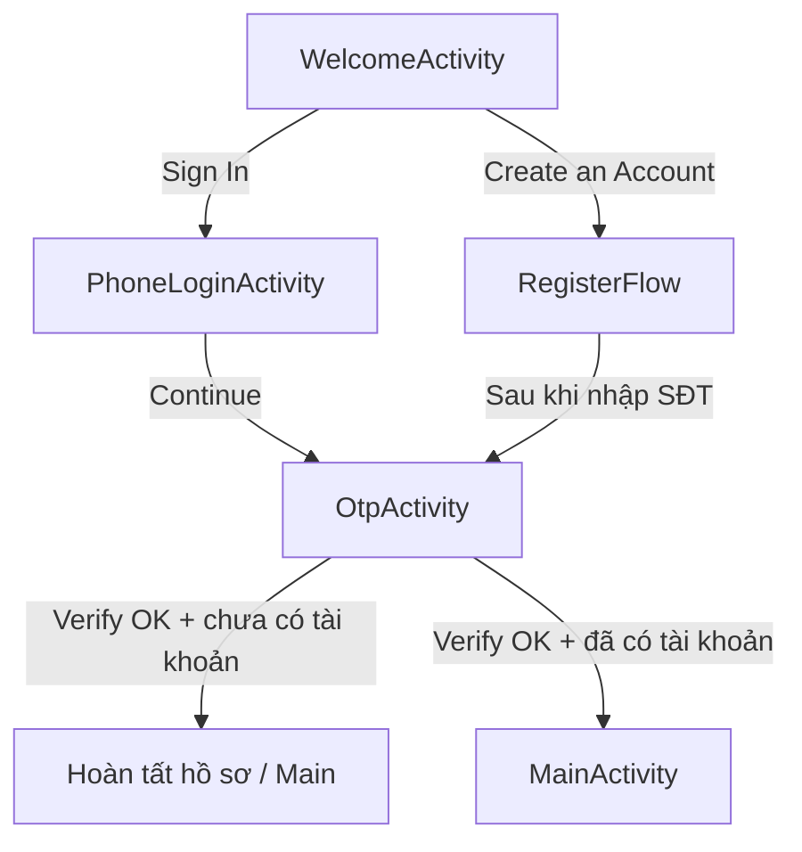

# Kế hoạch: UI đăng nhập / đăng ký (phong cách Toothly) + logic OTP + vai trò Admin / Doctor / Patient

Tài liệu **kế hoạch triển khai** (chưa mô tả trạng thái code sau khi bạn implement). Tham chiếu giao diện: mockup **Toothly** (nền teal/trắng, logo răng + smile, nút gradient teal/gold, typography serif tiêu đề + sans nội dung, luồng **SĐT + OTP**). Ảnh tham chiếu có thể lưu trong workspace (ví dụ thư mục `assets/` của project Cursor).

> **Đồng bộ token màu, form kính mờ, font (Poppins / Playfair) với tài liệu tổng:** [`PLAN_UI_UX_VA_DESIGN_SYSTEM.md`](./PLAN_UI_UX_VA_DESIGN_SYSTEM.md) — có mục *đối chiếu Toothly vs Trust Blue* để PO chốt brand.

---

## 1. Mục tiêu và phạm vi

| Hạng mục | Mô tả |
|----------|--------|
| **UI Android** | Ba nhóm màn hình tương ứng mockup: **Welcome / Onboarding**, **Đăng nhập (SĐT)**, **Nhập mã OTP**; luồng **Đăng ký chỉ dành cho Patient** (SĐT + OTP + hồ sơ) — xem mục 5. |
| **Logic auth** | Gửi OTP, xác thực OTP, tạo phiên đăng nhập an toàn (**JWT** đã có dependency sẵn trong `pom.xml`). |
| **Vai trò** | **Patient:** app mobile, SĐT + OTP, **tự đăng ký** qua luồng public. **Doctor:** **không** tự đăng ký; tài khoản do **Admin** tạo (API/console nội bộ), sau đó đăng nhập bằng **email + mật khẩu** (app staff hoặc web sau này). **Admin:** tạo tài khoản bác sĩ, đăng nhập staff tương tự (email + mật khẩu). **Lễ tân:** không portal riêng — **đăng nhập web Admin** (role `RECEPTIONIST` hoặc quyền tương đương), chỉ thấy module tiếp nhận / thu ngân / thiết bị quầy (xem [`PLAN_UI_UX_VA_DESIGN_SYSTEM.md`](./PLAN_UI_UX_VA_DESIGN_SYSTEM.md) §4.0). |
| **Monolith + MVC** | Một Spring Boot app: **Controller** (mỏng) → **Service** (nghiệp vụ, `@Transactional`) → **Repository** + **Entity**; **DTO** cho API; **config** / **security** / **exception** tách riêng. |

**Quy tắc sản phẩm (chốt):**

1. **Đăng ký công khai (`/api/auth/...` + màn “Create an Account” trên app bệnh nhân): chỉ Patient.**  
2. **Doctor không có endpoint / màn hình đăng ký tự phục vụ** — mọi tài khoản `Doctor` do **Admin** khởi tạo (email tạm / mật khẩu gửi nội bộ, đổi mật khẩu lần đầu nếu cần — phase sau).  
3. **Admin** có quyền **tạo tài khoản Doctor** (REST bảo vệ JWT role `ADMIN`, hoặc seed DB lúc dev).

**Ngoài phạm vi giai đoạn 1 (có thể để phase sau):** gửi SMS thật (Twilio, AWS SNS…), màn quản trị web, quên mật khẩu staff, 2FA.

---

## 2. Cấu trúc file theo kiến trúc dự án

Mọi file mới cho auth / admin **đặt đúng package** dưới `clinic_backend/src/main/java/com/hcmute/clinic/` và **không** tạo module Maven thứ hai (đúng **monolith**). Luồng xử lý: **HTTP → Controller → Service → Repository → Entity**.

### 2.1. Backend — cây package đề xuất (`com.hcmute.clinic`)

```
clinic_backend/src/main/java/com/hcmute/clinic/
├── ClinicApplication.java
├── config/
│   ├── SecurityConfig.java              # (chỉnh) JWT filter, permit public auth, phân quyền /api/admin/**
│   └── (tuỳ chọn) JwtProperties.java    # secret, expiry — @ConfigurationProperties
├── controller/
│   ├── AuthController.java              # (chỉnh) OTP request/verify, patient/register, staff/login
│   └── AdminDoctorController.java       # (mới) POST/GET /api/admin/doctors — @PreAuthorize("ROLE_ADMIN")
├── service/
│   ├── OtpService.java                  # tạo/verify OTP, rate limit
│   ├── AuthService.java                 # JWT, load user, staff login
│   ├── PatientRegistrationService.java  # (hoặc tên tương đương) hoàn tất đăng ký patient sau OTP
│   └── AdminDoctorService.java          # tạo Doctor + User, BCrypt
├── repository/
│   ├── PatientRepository.java           # (chỉnh) findByPhone, …
│   ├── DoctorRepository.java            # (mới) nếu chưa có
│   ├── AdminRepository.java             # (mới) nếu cần
│   └── OtpChallengeRepository.java      # (mới)
├── entity/
│   ├── User.java                        # (chỉnh) phone, role, …
│   ├── Patient.java                     # (chỉnh) đồng bộ phone nếu cần
│   ├── OtpChallenge.java                # (mới)
│   └── …                                # Doctor, Admin — giữ như hiện có
├── dto/
│   ├── auth/                            # (tuỳ chọn gói con) hoặc giữ flat
│   │   ├── OtpRequestDto.java
│   │   ├── OtpVerifyDto.java
│   │   ├── PatientRegisterDto.java
│   │   ├── StaffLoginRequest.java
│   │   └── AuthResponse.java            # (chỉnh) token, role, …
│   └── admin/
│       └── CreateDoctorRequest.java
├── enums/
│   ├── Role.java                        # (mới) PATIENT, DOCTOR, ADMIN
│   ├── OtpPurpose.java                  # (mới) LOGIN, REGISTER
│   └── …                                # các enum nghiệp vụ sẵn có
├── security/
│   ├── JwtService.java                  # ký/giải JWT
│   ├── JwtAuthenticationFilter.java     # đọc Bearer, set SecurityContext
│   └── UserDetailsServiceImpl.java      # load user theo email/phone cho Spring Security
└── exception/
    ├── ApiException.java                # (tuỳ chọn)
    └── GlobalExceptionHandler.java      # @ControllerAdvice — body lỗi thống nhất
```

**Tài nguyên & cấu hình:**

```
clinic_backend/src/main/resources/
├── application.yml
├── application-local.yml                # gitignore — DB password
└── application-local.yml.example
```

**Test (đề xuất):**

```
clinic_backend/src/test/java/com/hcmute/clinic/
├── service/OtpServiceTest.java
├── controller/AuthControllerIntegrationTest.java   # @SpringBootTest — tuỳ chọn
└── …
```

### 2.2. Android — cây module app (`mobile_android`)

Giữ namespace hiện tại `com.hcmute.mobile_android`; **tách theo lớp** tương tự MVC phía client: **UI (Activity) → gọi network → model DTO**.

```
mobile_android/app/src/main/java/com/hcmute/mobile_android/
├── ui/
│   └── activities/
│       ├── WelcomeActivity.java         # (mới) Toothly welcome
│       ├── PhoneLoginActivity.java      # (mới) SĐT
│       ├── OtpActivity.java             # (mới) 6 ô OTP
│       ├── RegisterActivity.java        # (chỉnh) chỉ patient — bước sau OTP
│       ├── MainActivity.java
│       └── (tuỳ chọn sau) staff/        # app bác sĩ/admin — module hoặc flavor sau này
├── network/
│   ├── ApiService.java                  # (chỉnh) otp, verify, patient/register
│   ├── RetrofitClient.java
│   └── models/
│       ├── OtpRequest.java, OtpVerifyRequest.java, …
│       ├── AuthResponse.java            # đồng bộ field với backend
│       └── MessageResponse.java
├── util/
│   └── TokenManager.java
└── (tuỳ chọn) ui/widgets/               # OTP box, gradient button — tái sử dụng
```

```
mobile_android/app/src/main/res/
├── layout/          # activity_welcome, activity_phone_login, activity_otp, …
├── values/          # colors.xml, themes.xml, strings.xml — token Toothly
├── drawable/        # logo, bg_gradient, nút pill
└── font/            # (tuỳ chọn) serif/sans
```

### 2.3. Tài liệu & asset

```
PhongKham/prod/                        # kế hoạch / kiến trúc (file bạn đang đọc)
PhongKham/docs/                        # (tuỳ chọn) thêm sau: API.md, wireframe
```

---

## 3. Thiết kế UI (bám mockup Toothly)

### 3.1. Design tokens (đề xuất)

- **Màu:** teal chủ đạo (`#0D9488` / `#14B8A6`), gold accent (`#D4AF37` → `#C0C0C0` gradient), nền trắng / off-white, chữ tiêu đề tối (`#0F172A`).
- **Typography:** tiêu đề **serif** (ví dụ `Cormorant Garamond`, `Playfair Display`); body và input **sans** (ví dụ `Inter`, `Roboto`).
- **Nút:** bo pill, gradient metallic (teal cho CTA chính welcome; gold cho Continue ở màn OTP/login tùy mockup).
- **Input SĐT:** underline / line-only như mockup “Mobile Number”.
- **OTP:** 6 ô vuông bo góc; có thể dùng `OTP` view hoặc 6 `EditText` + auto-focus chuyển ô.
- **Keypad tùy biến (optional):** mockup có bàn phím số chủ đề nha khoa — phase 1 có thể dùng **bàn phím hệ thống**; phase 2 làm custom `KeyboardView` / `GridLayout` nếu cần đúng pixel-perfect.

### 3.2. Màn hình và điều hướng (đề xuất)



- **Welcome:** logo + “Create an Account” + link “Sign In” + footer Terms/Privacy (có thể `TextView` + `LinkMovementMethod`).
- **Phone login:** back, logo nhỏ, “Log in”, field **Số điện thoại** (chuẩn hóa E.164 hoặc +84), “Continue”.
- **OTP:** hiển thị số đã che `+84 ••• ••• 0199`, 6 ô mã, “Didn’t get a code?” (resend + cooldown), “Continue”.
- **Đăng ký (Patient only):** wizard SĐT → OTP → họ tên / email tùy chọn / đồng ý điều khoản → vào `MainActivity`. **Không** có nhánh “đăng ký bác sĩ” trên app này.

### 3.3. Tài nguyên

- Vector/logo: tái tạo đơn giản bằng **vector drawable** hoặc asset PNG/WebP từ design.
- Background welcome: gradient + vector hills đơn giản (phase 1); ảnh 3D cao cấp (phase 2).

---

## 4. So khớp với code hiện tại

| Hiện tại | Hướng mới |
|----------|-----------|
| `LoginActivity` / `RegisterActivity` dùng **email + password** | Patient: **phone + OTP**; có thể giữ email là optional trong profile. |
| `AuthController` login **mock JWT**, register lưu password **không hash** | Hash mật khẩu (BCrypt) cho mọi luồng còn dùng password; JWT ký HS256/RS256 có expiry + refresh (optional). |
| Chỉ `PatientRepository` | Thêm repository/service cho OTP, và endpoint staff cho Doctor/Admin. |
| `User` có `email` unique | Thêm **`phone` unique** (nullable cho Doctor/Admin nếu chỉ dùng email); hoặc bảng riêng `phone_verifications` keyed by phone. |

---

## 5. Chiến lược vai trò (Admin / Doctor / Patient)

### 5.1. Nguyên tắc (đã chốt)

| Vai trò | Ai tạo tài khoản? | Đăng ký công khai? | Đăng nhập (đề xuất) |
|---------|-------------------|--------------------|------------------------|
| **Patient** | **Tự đăng ký** qua app (OTP + form) | **Có** — đúng luồng Toothly / `Create an Account` | SĐT + OTP → JWT |
| **Doctor** | **Chỉ Admin** (API admin hoặc thao tác nội bộ) | **Không** — không endpoint, không UI đăng ký doctor cho công chúng | Email + mật khẩu (`staff/login`) |
| **Admin** | Seed / super-admin đầu tiên; có thể thêm Admin khác do Admin hiện có (phase sau) | **Không** công khai | Email + mật khẩu |

- **Patient:** định danh chính **số điện thoại** đã verify OTP; entity `Patient` như hiện tại, bổ sung cột `phone` đồng bộ với `User` hoặc chỉ dùng phone trên `User` (cần thống nhất schema).
- **Doctor:** bản ghi `Doctor` + `User` chỉ xuất hiện sau khi **Admin** gọi API tạo tài khoản (mật khẩu hash BCrypt). **Cấm** mọi route kiểu `/api/auth/register` tạo role `DOCTOR` từ client không tin cậy.
- **Admin:** tạo và quản lý tài khoản bác sĩ; không dùng chung màn đăng ký với bệnh nhân.
- **Sau đăng nhập:** JWT chứa `sub` (user id), `role` (`PATIENT` | `DOCTOR` | `ADMIN`), `typ` access; app bệnh nhân chỉ chứa luồng Patient; Doctor/Admin dùng client riêng (app staff / web / Postman tạm).

### 5.2. Bảng phân quyền

Có thể chọn một trong hai (đề xuất **A** vì đã có `Patient` / `Doctor` / `Admin`):

- **A — Giữ JOINED / per-table subclass:** xác định role bằng **loại entity** (có `Patient` id → PATIENT, v.v.) hoặc thêm `role` enum trên `User` để query nhanh khi issue JWT.
- **B — Một bảng `users` + cột `role`:** refactor lớn, không khuyến nghị lúc này.

**Đề xuất thực thi:** thêm `enum Role { PATIENT, DOCTOR, ADMIN }` trên `User` (hoặc `MappedSuperclass` field) đồng bộ khi tạo `Patient`/`Doctor`/`Admin`, để `JwtService` không cần join phức tạp.

---

## 6. Mô hình dữ liệu (PostgreSQL)

### 6.1. Entity mới / chỉnh sửa

| Thực thể | Mục đích |
|----------|----------|
| **`OtpChallenge`** (tên bảng ví dụ `otp_challenges`) | `id`, `phone_e164`, `code_hash` (BCrypt hoặc HMAC của mã), `purpose` (`LOGIN`, `REGISTER`), `expires_at`, `attempts`, `consumed_at`, `created_at`. |
| **`User` / subclasses** | `phone` unique (nullable cho staff chỉ email); `password_hash` bắt buộc với staff; patient có thể không có password nếu **chỉ** OTP (lưu ý: refresh token / thiết bị — nên có password optional hoặc long-lived session policy). |
| **Patient** | Liên kết `User`; sau verify OTP lần đầu, tạo `Patient` + `User` role PATIENT. |

**Quyết định sản phẩm (cần chốt khi code):** Patient chỉ OTP không password → JWT + refresh token bắt buộc; hoặc sau OTP buộc đặt PIN/password cho lần sau.

### 6.2. Chỉ mục và ràng buộc

- Unique `(phone_e164)` trên user/patient phù hợp.
- OTP: rate limit theo `phone` + IP (tầng service hoặc bucket Redis — phase 1 có thể giới hạn trong DB + thời gian chờ).

---

## 7. API thiết kế (REST)

Base: `/api/auth`. Tất cả JSON, UTF-8.

| Method | Path | Mô tả |
|--------|------|--------|
| POST | `/api/auth/otp/request` | Body: `{ "phone": "+84901234567", "purpose": "LOGIN" \| "REGISTER" }`. Kiểm tra rate limit; tạo OTP; gửi SMS hoặc **dev: log ra console**. Trả `{ "expiresInSeconds": 300, "challengeId": "uuid" }` (optional) hoặc chỉ 204. |
| POST | `/api/auth/otp/verify` | Body: `{ "phone", "code", "purpose" }`. Verify; trả **pre-auth token** ngắn hạn hoặc trực tiếp **JWT** nếu user đã tồn tại. |
| POST | `/api/auth/patient/register` | Sau OTP REGISTER verified: `{ "phone", "firstName", "lastName", "email?" }` — **chỉ** tạo `Patient` + role PATIENT; trả JWT. **Không** nhận tham số role từ client. |
| POST | `/api/auth/staff/login` | Body: `{ "email", "password" }` — chỉ `Doctor`/`Admin`; trả JWT + role. |
| POST | `/api/auth/refresh` | (Optional) refresh token rotation. |

**Admin — tạo tài khoản Doctor** (JWT Admin bắt buộc; không public):

| Method | Path | Mô tả |
|--------|------|--------|
| POST | `/api/admin/doctors` *(hoặc tên namespace tương đương)* | Body: `{ "email", "password", "firstName", "lastName", ... }` — tạo `User` + `Doctor`, mật khẩu BCrypt. Validate email chưa tồn tại. |
| (tuỳ chọn) | `GET /api/admin/doctors` | Danh sách bác sĩ (phân trang). |

**Cấm:** `POST /api/auth/register` dạng “tự đăng ký doctor”; không có OTP purpose `REGISTER` tạo `Doctor`.

**Lưu ý bảo mật:** không trả lỗi chi tiết “số chưa đăng ký” vs “sai mã” trong môi trường production nếu dễ bị enumerate — có thể thống nhất message.

---

## 8. Backend — lộ trình triển khai (MVC)

*(Cấu trúc file từng package: **mục 2**; mục này là thứ tự công việc.)*

1. **`config`:** `SecurityFilterChain` — permit `/api/auth/**` tạm thời hoặc tách public vs JWT filter; cấu hình `PasswordEncoder` BCrypt.
2. **`service`:** `OtpService` (tạo mã 6 số, hash lưu DB, verify, expire); `AuthService` (issue JWT, load UserDetails); `PatientOnboardingService`; **`AdminDoctorService`** (tạo `Doctor`, chỉ gọi từ controller có `@PreAuthorize("hasRole('ADMIN')")` hoặc tương đương).
3. **`util` / `security`:** `JwtService` (generate/parse, claim role).
4. **`controller`:** `AuthController` (patient OTP + patient register + staff login); **`AdminDoctorController`** (CRUD tạo bác sĩ — chỉ Admin).
5. **`exception`:** `@ControllerAdvice` — format lỗi `{ "message", "code" }` thống nhất với Android.
6. **Migration:** với `ddl-auto: update` có thể đủ cho dev; production nên Flyway/Liquibase (phase sau).

---

## 9. Android — lộ trình triển khai

*(Cây thư mục chi tiết: **mục 2.2**.)*

1. **Theme:** `themes.xml` màu teal/gold; style nút pill; font (downloadable hoặc asset).
2. **Activities/Fragments:** `WelcomeActivity`, `PhoneLoginActivity`, `OtpActivity`, refactor `RegisterActivity` thành các bước SĐT → OTP → thông tin.
3. **Navigation:** `Activity` + explicit intent hoặc **Navigation Component** (Kotlin optional; hiện project Java).
4. **Network:** mở rộng `ApiService` — `requestOtp`, `verifyOtp`, `registerPatient` (**patient only**). **Không** thêm API đăng ký doctor trên app bệnh nhân. App staff (sau) gọi `staff/login` + (nếu là admin app) `POST /api/admin/doctors`.
5. **Lưu token:** mở rộng `TokenManager` (SharedPreferences encrypted nếu có `security-crypto`).
6. **`RetrofitClient`:** base URL qua `BuildConfig` / `local.properties` thay vì IP cứng.

---

## 10. OTP và SMS

| Giai đoạn | Cách làm |
|-----------|----------|
| **Dev** | Log mã OTP ra console/logger; có thể fix mã `123456` khi profile `dev`. |
| **Prod** | Tích hợp nhà cung cấp SMS; lưu API key trong biến môi trường, không commit. |

---

## 11. Bảo mật và vận hành

- Không commit mật khẩu DB hay JWT secret: dùng `application-local.yml` (đã **gitignore**) hoặc biến môi trường.
- JWT: secret đủ dài, `exp` ngắn (15–60 phút); cân nhắc refresh token.
- HTTPS cho production; Android dùng **network security config** thay vì `usesCleartextTraffic` khi deploy thật.

---

## 12. Kiểm thử

- Unit: `OtpService` (expire, sai mã, đúng mã).
- Integration: `@SpringBootTest` + Testcontainers PostgreSQL (optional) cho flow register.
- Android: UI test (Espresso) cho nhập SĐT + OTP (mock server **MockWebServer**).

---

## 13. Checklist hoàn thành

- [ ] Theme + 3 màn Toothly-style (welcome, phone, OTP) + luồng đăng ký.
- [ ] Entity + repository OTP; chỉnh `User`/`Patient` cho phone.
- [ ] `OtpService` + rate limit tối thiểu.
- [ ] `JwtService` + filter; `staff/login` BCrypt.
- [ ] `SecurityConfig` đồng bộ với JWT.
- [ ] Android gọi đủ API; xử lý lỗi + resend OTP + cooldown.
- [ ] Seed 1 Admin; **Doctor** chỉ tạo qua `POST /api/admin/doctors` (hoặc seed SQL) — không đăng ký public.
- [ ] Kiểm tra: không có đường nào cho phép client tự tạo role `DOCTOR`.
- [ ] Cập nhật `prod/KIEN_TRUC_VA_LOGIC.md` sau khi code xong.

---

## 14. Cấu hình PostgreSQL (máy bạn)

- **Không** ghi mật khẩu thật vào file markdown trong git.
- Đã cấu hình:
  - `application.yml`: profile mặc định `local`, `password: ${DB_PASSWORD:123}`.
  - `application-local.yml`: file cục bộ **đã thêm vào `.gitignore`** — dùng để ghi đè mật khẩu DB trên máy bạn.
  - `application-local.yml.example`: mẫu cho thành viên khác (không chứa secret).

Khi clone repo máy mới: sao chép `application-local.yml.example` → `application-local.yml` và điền mật khẩu, hoặc export `DB_PASSWORD` và đặt `SPRING_PROFILES_ACTIVE` khác `local` nếu không dùng file local.

---

## 15. Thứ tự thực hiện đề xuất (2 sprint ngắn)

1. **Sprint A — Backend auth lõi:** OTP entity + service + verify; JWT; BCrypt staff; **`POST /api/admin/doctors`** (Admin only); seed 1 Admin; cập nhật Security.
2. **Sprint B — Android UI:** Welcome + Phone + OTP + đăng ký; nối API; polish gradient/font.

---

*Tài liệu này là plan; cập nhật khi chốt quyết định sản phẩm (patient có/không password sau OTP, có hay không refresh token).*
