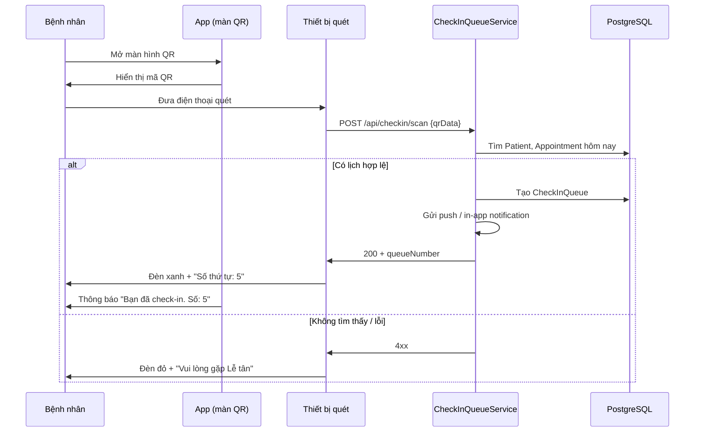
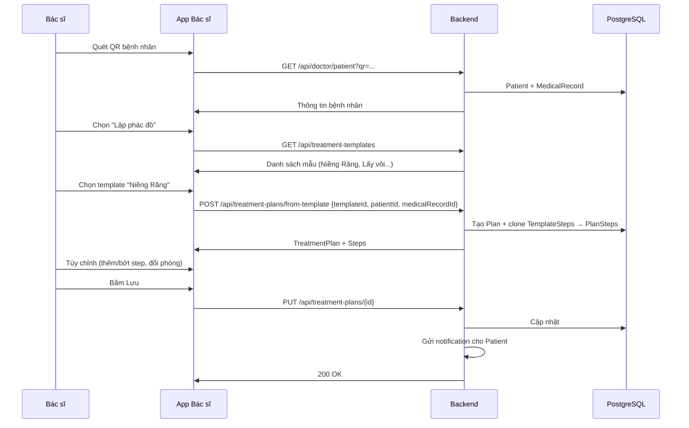

# Kế hoạch: Self Check-in QR + Lập Phác Đồ Điều Trị

Tài liệu **product & technical plan** cho hai use case: **Khởi tạo luồng tiếp nhận bằng QR Code** và **Lập Phác Đồ Điều Trị**. Đóng vai Product Leader, xem xét góc nhìn **Bệnh nhân** và **Bác sĩ**, UI/UX cần hiển thị rõ ràng các thông tin quan trọng.

> **Tài liệu bổ sung:** [`PLAN_SMART_DENTAL_BO_SUNG.md`](./PLAN_SMART_DENTAL_BO_SUNG.md) — Hàng đợi nâng cao (rẽ nhánh X-Quang, đôn ưu tiên), QR động bảo mật, Real-time, UI chuyên sâu theo dịch vụ nha khoa (Odontogram, Form Nhổ/Niềng/Implant).  
> **UI/UX & Design System:** [`PLAN_UI_UX_VA_DESIGN_SYSTEM.md`](./PLAN_UI_UX_VA_DESIGN_SYSTEM.md) — Bảng màu (Trust Blue / Calm Teal), form kính mờ & typography, micro-interactions, spec Patient / Bác sĩ / Lễ tân / Kiosk, kiến trúc component & JSON form.

---

## 1. Tổng quan góc nhìn Actor

### 1.1. Bệnh nhân (Patient)

| Trạng thái | Cần thấy gì | Cảm xúc / Mục tiêu |
|------------|-------------|--------------------|
| Đến phòng khám | "Tôi cần check-in nhanh, biết số thứ tự" | Giảm lo lắng, chờ đợi rõ ràng |
| Sau check-in | "Số thứ tự của tôi là bao nhiêu? Vào phòng nào?" | Yên tâm biết mình đã được tiếp nhận |
| Trong quá trình điều trị | "Phác đồ của tôi có những bước gì? Đi phòng nào tiếp theo?" | Tự chủ di chuyển, không bị lạc |

### 1.2. Bác sĩ (Doctor)

| Trạng thái | Cần thấy gì | Mục tiêu |
|------------|-------------|----------|
| Sau khi quét QR bệnh nhân | "Đây là bệnh nhân X, hồ sơ khám hiện tại" | Ngữ cảnh bệnh nhân ngay lập tức |
| Lập phác đồ | "Chọn mẫu → tùy chỉnh → lưu nhanh" | Giảm thao tác, tránh sai sót |
| Sau khi lưu | "Đã lưu; bệnh nhân sẽ thấy trên app" | Tin tưởng đồng bộ 2 phía |

---

## 2. Use Case 1: Self Check-in QR Code — Phân tích chi tiết

### 2.1. Luồng chính (Main Flow)



### 2.2. UI cần hiển thị — Góc nhìn Bệnh nhân

| Màn hình | Nội dung cần rõ | Ghi chú UX |
|----------|-----------------|------------|
| **Màn QR Check-in** | QR code lớn, dễ quét | Contrast cao, nền trắng, kích thước tối thiểu 200x200dp |
| | Hướng dẫn: "Đưa mã QR qua máy quét tại quầy tiếp nhận" | Text ngắn, icon minh họa |
| | Trạng thái: "Chưa check-in" / "Đã check-in" | Màu xám vs xanh |
| **Sau check-in thành công** | Số thứ tự: **5** | Font lớn, nổi bật |
| | Phòng chờ / phòng khám: "Phòng 1 - Tầng 1" | Giúp bệnh nhân biết đi đâu |
| | "Chờ đến lượt, vui lòng theo dõi màn hình" | Giảm hỏi lễ tân |
| **Thông báo (push/in-app)** | "Bạn đã check-in thành công. Số thứ tự: 5." | Ngắn gọn, đủ thông tin |

### 2.3. Luồng ngoại lệ

| Tình huống | Hành vi | UI / Feedback |
|------------|---------|---------------|
| Mã QR không tồn tại | API 404 | Thiết bị quét: đèn đỏ + "Mã không hợp lệ" |
| Không có lịch hẹn hôm nay | API 400 | Đèn đỏ + "Không có lịch hẹn hôm nay. Vui lòng gặp Lễ tân." |
| Đã check-in rồi | API 409 | Đèn vàng + "Bạn đã check-in trước đó. Số: X" |
| Lỗi mạng / server | API 5xx | Đèn đỏ + "Lỗi hệ thống. Thử lại hoặc gặp Lễ tân." |

### 2.4. Thiết bị quét — Góc nhìn Lễ tân / Hệ thống

- Thiết bị quét: có thể là **máy quét USB** gắn máy tính chạy web app, hoặc **tablet** chạy app tiếp nhận.
- Màn hình hiển thị: **Đèn xanh / đỏ / vàng** rõ ràng; **số thứ tự** lớn; nút "Quét tiếp" để chờ bệnh nhân tiếp theo.

---

## 3. Use Case 2: Lập Phác Đồ Điều Trị — Phân tích chi tiết

### 3.1. Luồng chính



### 3.2. UI cần hiển thị — Góc nhìn Bác sĩ

| Màn hình | Nội dung cần rõ | Ghi chú UX |
|----------|-----------------|------------|
| **Context bệnh nhân (sau quét QR)** | Tên, SĐT, ngày sinh | Header cố định khi làm việc |
| | MedicalRecord gần nhất: chẩn đoán, triệu chứng | Collapse/expand nếu dài |
| | Nút rõ ràng: "Lập phác đồ điều trị" | CTA chính |
| **Chọn mẫu** | Danh sách template: icon + tên (Niềng Răng, Lấy vôi, Nhổ răng...) | Card hoặc list, dễ chạm |
| **Màn lập/chỉnh sửa phác đồ** | Danh sách bước (Step) — thứ tự, tên dịch vụ, phòng | Drag to reorder nếu cần |
| | Mỗi step: Service (dropdown), ClinicRoom (dropdown), Ghi chú | Inline edit hoặc form modal |
| | Nút "Thêm bước" / "Xóa bước" | Rõ ràng |
| | Nút "Lưu" — primary | Xác nhận trước khi gửi |
| **Sau khi lưu** | Toast / Snackbar: "Đã lưu. Bệnh nhân có thể xem trên app." | Feedback ngay |

### 3.3. UI cần hiển thị — Góc nhìn Bệnh nhân (App)

| Màn hình | Nội dung cần rõ | Ghi chú UX |
|----------|-----------------|------------|
| **Phác đồ điều trị (Treatment Plan)** | Tiêu đề: "Phác đồ điều trị của bạn" | Có trong Main / tab "Lịch khám" |
| | Trạng thái: Đang thực hiện / Hoàn thành | Badge màu |
| | Danh sách bước dạng timeline: | |
| | — Bước 1: Chụp X-Quang — Phòng 2 — **Đang chờ** | Icon, màu theo trạng thái |
| | — Bước 2: Lấy vôi răng — Phòng 3 — Tiếp theo | |
| | — Bước 3: Khám bác sĩ — Phòng 1 | |
| | Hướng dẫn: "Bước tiếp theo: Chụp X-Quang tại Phòng 2, Tầng 1" | Nổi bật, dễ đọc |
| **Thông báo (khi BS lập mới)** | "Bác sĩ đã lập phác đồ điều trị cho bạn. Xem chi tiết." | Push + in-app |

---

## 4. Gap analysis — So với code hiện tại

| Thành phần | Hiện có | Cần bổ sung |
|------------|---------|-------------|
| **Patient** | `qrCodeData` (String) | Cần sinh QR khi đăng ký; format `patient:{id}` hoặc UUID |
| **CheckInQueue** | Entity đủ | Repository, Service, Controller |
| **Appointment** | Entity | Cần AppointmentRepository, query "hôm nay + patient" |
| **TreatmentPlanTemplate** | **Chưa có** | Entity + TemplateStep (template_id, service_id, sequence_order, clinic_room_id) |
| **TreatmentPlan** | Entity, `templateId` | Logic clone từ template |
| **TreatmentPlanStep** | Entity | Repository, API CRUD |
| **Notification** | Entity | Service gửi thông báo, API lấy danh sách |
| **Thiết bị quét** | Không | Web app đơn giản hoặc API cho thiết bị bên ngoài |
| **App Patient** | MainActivity placeholder | Màn QR, màn Phác đồ, nhận notification |
| **App Doctor** | Không | Module riêng (web hoặc Android) |

---

## 5. Thứ tự triển khai đề xuất

### Phase A — Nền tảng (Foundation)

| Thứ tự | Công việc | Lý do |
|--------|-----------|-------|
| A1 | Sinh `qrCodeData` cho Patient khi đăng ký (format `patient:{id}`) | Bệnh nhân mới cần có QR |
| A2 | Migration / script sinh QR cho Patient đã có sẵn | Dữ liệu cũ |
| A3 | TreatmentPlanTemplate + TemplateStep entity, seed mẫu "Niềng Răng", "Lấy vôi" | Phục vụ Use Case 2 |
| A4 | AppointmentRepository, CheckInQueueRepository | Truy vấn dữ liệu |
| A5 | Seed: ClinicRoom, Service, Doctor, Appointment mẫu | Môi trường test |

### Phase B — Use Case 1: Self Check-in

| Thứ tự | Công việc | Deliverable |
|--------|-----------|-------------|
| B1 | CheckInQueueService: `processScan(qrData)` → validate, tạo queue | Backend logic |
| B2 | POST `/api/checkin/scan` (public hoặc API key cho scanner) | API |
| B3 | App Patient: màn "Mã QR của tôi" (hiển thị qrCodeData dạng QR) | UI |
| B4 | App Patient: màn "Trạng thái check-in" (số thứ tự nếu đã check-in) | UI |
| B5 | Web page đơn giản cho thiết bị quét: nhập QR (paste/camera) → gọi API → hiển thị đèn + số | Scanner UI |
| B6 | Notification khi check-in thành công (in-app; push nếu có FCM) | Optional |

### Phase C — Use Case 2: Lập Phác Đồ

| Thứ tự | Công việc | Deliverable |
|--------|-----------|-------------|
| C1 | TreatmentPlanService: `createFromTemplate(templateId, patientId, medicalRecordId)` | Backend |
| C2 | GET `/api/treatment-templates`, POST `/api/treatment-plans/from-template` | API |
| C3 | PUT `/api/treatment-plans/{id}` (cập nhật steps) | API |
| C4 | App Doctor (web): màn quét QR → context bệnh nhân → Lập phác đồ → chọn template → chỉnh sửa → lưu | Doctor UI |
| C5 | Gửi Notification cho Patient khi plan mới/cập nhật | Backend |
| C6 | App Patient: màn "Phác đồ điều trị" — danh sách steps, phòng, trạng thái | Patient UI |

### Phase D — Polish & Hàng đợi nâng cao

| Thứ tự | Công việc |
|--------|-----------|
| D1 | Xử lý đầy đủ luồng ngoại lệ (đã check-in, không có lịch, v.v.) |
| D2 | Real-time: Patient xem số thứ tự cập nhật (polling / WebSocket) |
| D3 | Phân quyền: API Doctor cần JWT role DOCTOR |
| D4+ | **Xem bổ sung:** Rẽ nhánh X-Quang, đôn ưu tiên, Dashboard Lễ tân → [`PLAN_SMART_DENTAL_BO_SUNG.md`](./PLAN_SMART_DENTAL_BO_SUNG.md) |

### Phase E — UI chuyên sâu Nha khoa *(Scope riêng)*

| Thứ tự | Công việc |
|--------|-----------|
| E1 | Odontogram FDI tương tác, Form theo dịch vụ (Nhổ/Niềng/Implant/Nha chu) |
| | Chi tiết → [`PLAN_SMART_DENTAL_BO_SUNG.md`](./PLAN_SMART_DENTAL_BO_SUNG.md) mục 5 |

---

## 6. Sơ đồ màn hình (Wireframe tóm tắt)

### 6.1. App Bệnh nhân

```
[Welcome/Login]
      ↓
[Main - Tab: Trang chủ | Phác đồ | QR Check-in]
      ↓
┌─────────────────────────────────┐
│ Tab "QR Check-in"               │
│  ┌─────────────────────────┐   │
│  │     ▓▓▓ QR CODE ▓▓▓     │   │
│  │   (patient:123 hoặc     │   │
│  │    UUID)                │   │
│  └─────────────────────────┘   │
│  Đưa mã qua máy quét tại       │
│  quầy tiếp nhận                │
│  ─────────────────────────     │
│  Trạng thái: Đã check-in ✓     │
│  Số thứ tự: 5                  │
│  Phòng: Phòng 1 - Tầng 1       │
└─────────────────────────────────┘

┌─────────────────────────────────┐
│ Tab "Phác đồ điều trị"          │
│  ● Bước 1: Chụp X-Quang        │
│    Phòng 2 — Đang chờ          │
│  ○ Bước 2: Lấy vôi răng        │
│    Phòng 3 — Tiếp theo         │
│  ○ Bước 3: Khám bác sĩ         │
│    Phòng 1                     │
│  ─────────────────────────     │
│  👉 Tiếp theo: Chụp X-Quang    │
│     tại Phòng 2, Tầng 1        │
└─────────────────────────────────┘
```

### 6.2. App / Web Bác sĩ

```
[Login Doctor]
      ↓
[Quét QR bệnh nhân]
      ↓
┌─────────────────────────────────┐
│ Nguyễn Văn A | 0901234567       │
│ Hồ sơ gần nhất:                 │
│ - Chẩn đoán: Sâu răng           │
│ - Triệu chứng: Đau nhức         │
│ [Lập phác đồ điều trị]          │
└─────────────────────────────────┘
      ↓
┌─────────────────────────────────┐
│ Chọn mẫu phác đồ                │
│  [Niềng Răng] [Lấy vôi] [Nhổ]   │
└─────────────────────────────────┘
      ↓
┌─────────────────────────────────┐
│ Chỉnh sửa phác đồ               │
│  1. Chụp X-Quang — Phòng 2  [x] │
│  2. Lấy vôi — Phòng 3       [x] │
│  3. Khám BS — Phòng 1       [x] │
│  [+ Thêm bước]                  │
│  [Lưu]                          │
└─────────────────────────────────┘
```

---

## 7. Format QR Code & API Contract

### 7.1. QR payload

- **Phase B cơ bản:** `patient:{patientId}` — đơn giản, dễ triển khai.
- **Phase B nâng cao (bảo mật):** One-Time Dynamic JWT — xem [`PLAN_SMART_DENTAL_BO_SUNG.md`](./PLAN_SMART_DENTAL_BO_SUNG.md) mục 3.

### 7.2. API Check-in

```
POST /api/checkin/scan
Content-Type: application/json
Body: { "qrData": "patient:42" }

200 OK:
{
  "queueNumber": 5,
  "roomName": "Phòng 1",
  "roomLocation": "Tầng 1",
  "message": "Check-in thành công"
}

400: Không có lịch hẹn hôm nay
404: Mã không hợp lệ
409: Đã check-in (body chứa queueNumber hiện tại)
```

---

## 8. Checklist hoàn thành

- [ ] Patient có qrCodeData khi đăng ký
- [ ] TreatmentPlanTemplate + TemplateStep + seed data
- [ ] CheckInQueueService + API /api/checkin/scan
- [ ] App Patient: màn QR + màn Phác đồ
- [ ] App/Web Doctor: luồng quét QR → lập phác đồ
- [ ] Notification khi check-in + khi có phác đồ mới
- [ ] Thiết bị quét (web hoặc app) với đèn xanh/đỏ/vàng
- [ ] UI theo [`PLAN_UI_UX_VA_DESIGN_SYSTEM.md`](./PLAN_UI_UX_VA_DESIGN_SYSTEM.md) (token màu, skeleton, kiosk, queue lớn — theo từng sprint)
- [ ] Xử lý đầy đủ luồng ngoại lệ
- [ ] Cập nhật KIEN_TRUC_VA_LOGIC.md sau khi triển khai

---

*Tài liệu này là kế hoạch chi tiết; cập nhật khi chốt quyết định kỹ thuật hoặc thay đổi phạm vi.*
