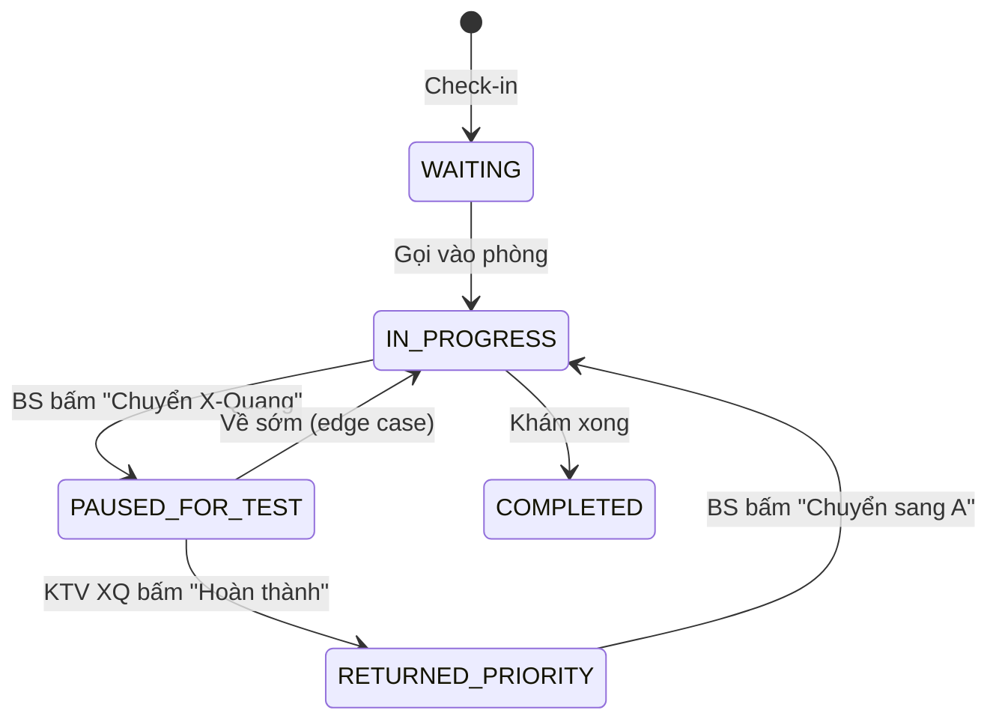

# Bổ sung: Smart Dental Clinic — Hàng đợi nâng cao, QR bảo mật, UI chuyên sâu

Tài liệu **bổ sung** cho [`PLAN_CHECKIN_VA_PHAC_DO.md`](./PLAN_CHECKIN_VA_PHAC_DO.md). Tích hợp bài toán **"Rẽ nhánh X-Quang & Đôn hàng đợi"**, **QR động bảo mật**, **Real-time**, và **UI chuyên sâu theo từng dịch vụ nha khoa**. Đối chiếu với project hiện tại.

> **Design system & UX chi tiết (màu, kiosk, queue, form):** [`PLAN_UI_UX_VA_DESIGN_SYSTEM.md`](./PLAN_UI_UX_VA_DESIGN_SYSTEM.md).

---

## 1. Đối chiếu Project hiện tại vs Yêu cầu mới

| Thành phần | Hiện tại (Code) | Yêu cầu mới | Gap |
|------------|-----------------|-------------|-----|
| **QueueStatus** | `WAITING`, `IN_PROGRESS`, `COMPLETED`, `SKIPPED` | Thêm `PAUSED_FOR_TEST`, `RETURNED_PRIORITY` | Bổ sung 2 giá trị enum |
| **CheckInQueue** | `appointment`, `clinicRoom`, `treatmentPlanStep`, `queueNumber`, `priorityLevel` | Cần `currentRoomType` (KHAM, X_RAY)? Hoặc dùng `treatmentPlanStep` | Có thể đủ; cần thêm `notes` nếu cần |
| **Patient.qrCodeData** | String tĩnh | **One-Time Dynamic QR** (JWT) | Thay đổi logic: App gọi API sinh JWT, QR hiển thị JWT |
| **Service** | `name`, `description`, `price`, `durationMinutes` | `uiTemplateType` (SURGERY, ORTHO, IMPLANT, PERIO, GENERAL) | Thêm cột enum |
| **MedicalRecordDetail** | `toothNumber` (FDI), `treatmentNote` | Đủ cho Odontogram mapping | OK |
| **Real-time** | Không có | WebSocket/SSE | Thêm dependency + endpoint |
| **Redis** | Không | Cache token QR đã dùng | Thêm (optional Phase B) |

---

## 2. Bài toán: Rẽ nhánh X-Quang & Đôn hàng đợi

### 2.1. Vòng đời trạng thái (Queue Status Machine)

| Trạng thái | Mô tả | Nơi bệnh nhân | QueueStatus đề xuất |
|------------|-------|---------------|---------------------|
| Chờ ở sảnh | Trong danh sách "Sắp tới" của bác sĩ | Sảnh lễ tân | `WAITING` |
| Trong phòng khám | Đang được khám | Phòng BS | `IN_PROGRESS` |
| Đi chụp X-Quang | BS bấm "Chuyển X-Quang", BN A tạm cất | Hành lang / trước phòng X-Quang | `PAUSED_FOR_TEST` *(mới)* |
| Chờ kết quả X-Quang | A trong hàng đợi phòng X-Quang | Phòng X-Quang | `PAUSED_FOR_TEST` |
| Cầm kết quả về | KTV X-Quang bấm "Hoàn thành" | Về phòng khám | `RETURNED_PRIORITY` *(mới)* |
| Hoàn thành | Khám xong, ra về | — | `COMPLETED` |
| Bỏ qua | Không đến / hủy | — | `SKIPPED` |

### 2.2. Luồng chi tiết (BN A đi X-Quang, BS khám BN B)



### 2.3. UX tại điểm chạm

| Actor | Hành vi | UI/Feedback |
|-------|---------|-------------|
| **Bác sĩ** | BN A quay lại có kết quả X-Quang | Toast/Badge: "Bệnh nhân A (Nhổ răng khôn) đã sẵn sàng. [Chuyển sang A] [Giữ B ở lại]" |
| **Bác sĩ** | Tạm dừng hồ sơ B để xem A | Nút "Tạm dừng" → hồ sơ B collapse, chuyển sang A |
| **Bệnh nhân A** | Nhận thông báo khi có kết quả | "Đã có kết quả X-Quang. Vui lòng quay lại Phòng 1. Bạn được ưu tiên." |
| **Bệnh nhân B** | Đang khám, BS cần xử lý A | BS giải thích; B chờ 1–2 phút |

### 2.4. Cập nhật Entity (đề xuất)

**QueueStatus** — thêm giá trị:

```java
public enum QueueStatus {
    WAITING,           // Chờ ở sảnh
    IN_PROGRESS,       // Đang khám / đang ở phòng
    PAUSED_FOR_TEST,   // Đi chụp X-Quang / xét nghiệm
    RETURNED_PRIORITY, // Đã về, ưu tiên lên đầu
    COMPLETED,
    SKIPPED
}
```

**CheckInQueue** — có thể cần:
- `currentRoomId` hoặc dùng `clinicRoom` + `treatmentPlanStep` để suy luận
- `pausedAt`, `returnedAt` (LocalDateTime) — optional cho audit

---

## 3. One-Time Dynamic QR (Chống giả mạo)

### 3.1. So sánh với QR tĩnh

| Tiêu chí | QR tĩnh `patient:42` | QR động (JWT) |
|----------|----------------------|---------------|
| Chống chụp lén | Không | Có — mỗi lần mở App sinh token mới |
| Hết hạn | Không | Có — exp 3–5 phút |
| One-time | Không | Có — sau khi quét, token đánh dấu "đã dùng" |
| Offline | Có (hiển thị sẵn) | Không — cần gọi API khi mở màn QR |

### 3.2. Luồng kỹ thuật

1. **App bệnh nhân** mở màn "QR Check-in" → gọi `GET /api/checkin/qr-token` (cần JWT auth).
2. **Backend** sinh JWT: `{ patientId, exp: now+3min, jti: uuid }` → trả chuỗi JWT.
3. **App** render QR từ chuỗi JWT (đủ ngắn để QR không quá dày).
4. **Thiết bị quét** gửi `POST /api/checkin/scan` body `{ "qrData": "eyJhbGc..." }`.
5. **Backend** verify JWT, kiểm tra `jti` chưa trong Redis (đã dùng) → tạo CheckInQueue, lưu `jti` vào Redis TTL 10 phút.
6. Nếu đã dùng hoặc hết hạn → 401.

### 3.3. API mới

```
GET /api/checkin/qr-token
Authorization: Bearer <patient_jwt>

200: { "token": "eyJhbGciOi...", "expiresIn": 180 }

POST /api/checkin/scan
Body: { "qrData": "eyJhbGciOi..." }
# Backend parse JWT, lấy patientId, verify jti chưa dùng
```

---

## 4. Real-time Queue Engine

### 4.1. Kênh cập nhật

| Kênh | Công nghệ | Use case |
|------|-----------|----------|
| App Bệnh nhân | WebSocket / SSE / Polling | Số thứ tự, "đến lượt", "quay lại phòng" |
| Màn hình TV Lễ tân | WebSocket / SSE | Chớp nháy số gọi |
| App/Web Bác sĩ | WebSocket / SSE | Pop-up "BN A đã có kết quả X-Quang" |

### 4.2. Sự kiện broadcast

| Event | Payload | Subscribers |
|-------|---------|-------------|
| `queue.updated` | `{ queueId, queueNumber, status, roomName }` | Patient app, TV |
| `queue.priority_returned` | `{ patientId, patientName, appointmentId }` | Doctor app |
| `queue.called` | `{ queueNumber, roomName }` | TV, Patient app |

### 4.3. Triển khai gợi ý

- **Phase B/C**: Polling mỗi 10–15 giây — đơn giản, đủ dùng.
- **Phase D**: WebSocket (Spring WebSocket + STOMP) hoặc SSE — real-time thật.

---

## 5. UI/UX chuyên sâu theo dịch vụ nha khoa

### 5.1. Service.ui_template_type

**Bổ sung vào Entity Service:**

```java
@Enumerated(EnumType.STRING)
@Column(name = "ui_template_type")
private UiTemplateType uiTemplateType = UiTemplateType.GENERAL;

public enum UiTemplateType {
    GENERAL,   // Khám tổng quát
    SURGERY,   // Nhổ răng, tiểu phẫu
    ORTHO,     // Niềng răng
    IMPLANT,   // Phục hình, cấy ghép
    PERIO      // Nha chu, nội nha
}
```

**Logic Frontend:** Khi bác sĩ chọn Service (trong phác đồ hoặc hồ sơ), load đúng form widget theo `uiTemplateType`.

### 5.2. Interactive Odontogram (Sơ đồ răng FDI)

| Yêu cầu | Chi tiết |
|---------|----------|
| Chuẩn | FDI — 11–18, 21–28, 31–38, 41–48 |
| Tương tác | Click răng → chọn tình trạng (Mọc lệch, Sâu, Vỡ, Mất...) |
| Mặt răng | Mặt nhai, ngoài, trong, kẽ (nếu cần chi tiết) |
| Map mã bệnh | Tự động gợi ý ICD-10/ICD-11 khi chọn tình trạng |
| Lưu trữ | `MedicalRecordDetail.toothNumber` + `treatmentNote` (hoặc bảng riêng `tooth_conditions`) |

### 5.3. Form theo nhóm dịch vụ

| Nhóm | ui_template_type | Widget bắt buộc | Ghi chú |
|------|------------------|-----------------|---------|
| **Nhổ răng (Khôn, Tiểu phẫu)** | SURGERY | Form đánh giá nguy cơ (Huyết áp, Tim mạch, Máu khó đông); Checkbox "Đã ký cam kết" (E-signature); Nút "Kê đơn giảm đau tự động" | Pháp lý, an toàn |
| **Niềng răng** | ORTHO | Thư viện ảnh Before/After (slider); Bảng lộ trình khay (Khay 1/40); Lịch tái khám tự động (mỗi 4 tuần) | Dài hạn |
| **Phục hình (Implant, Sứ)** | IMPLANT | Dropdown trụ (Osstem, Straumann...); Ghi chú Labo (màu A1, A2, form răng); Mã bảo hành | Liên kết Labo |
| **Nha chu, Nội nha** | PERIO | Form chỉ số túi nha chu; Form số ống tủy đã nong bít | Thông số kỹ thuật |

### 5.4. Luồng lazy-load UI

```
Bác sĩ chọn Step: "Nhổ răng khôn" (Service.uiTemplateType = SURGERY)
  → Frontend load component <SurgeryForm />
  → Hiển thị: Odontogram + Form đánh giá + E-signature
```

---

## 6. Wireframe cập nhật

### 6.1. Màn hình Bác sĩ (Xử lý đôn hàng + Form răng khôn)

```
┌─────────────────────────────────────────────────────────────────┐
│ [HÀNG ĐỢI]              │  BỆNH NHÂN: NGUYỄN VĂN A              │
│ ─────────────────────── │  Dịch vụ: Nhổ răng khôn mọc lệch      │
│ 🔴 A (Trở về từ XQ)     │ ─────────────────────────────────────  │
│ 🟢 B (Đang khám)        │  [ SƠ ĐỒ RĂNG FDI ]                   │
│ ⚪ C (Chờ khám)         │     Răng 38 — Đánh dấu đỏ             │
│ ⚪ D (Chờ khám)         │ ─────────────────────────────────────  │
│ ─────────────────────── │  [x] Đã đo Huyết áp (120/80)          │
│ ⚠️ Bệnh nhân A đã có    │  [x] Bệnh nhân đã ký cam kết          │
│ kết quả X-Quang.        │  Ghi chú: Chân răng cong              │
│ [Chuyển sang A]         │ ─────────────────────────────────────  │
│ [Giữ B ở lại]           │  [Lưu & Kê đơn] [Chuyển Lễ Tân]       │
└─────────────────────────────────────────────────────────────────┘
```

### 6.2. Dashboard Lễ tân / Quản lý

> **Triển khai:** màn hình này là **module trong web Admin** (portal nội bộ), không phải sản phẩm URL riêng — xem [`PLAN_UI_UX_VA_DESIGN_SYSTEM.md`](./PLAN_UI_UX_VA_DESIGN_SYSTEM.md) §4.0.

```
┌─────────────────────────────────────────────────────────────────┐
│ TỔNG QUAN HÀNG ĐỢI — NGÀY 23/03/2026                            │
│ ───────────────────────────────────────────────────────────────  │
│ [Phòng Khám 1 - BS Trần X]  │ [Phòng X-Quang]                    │
│ Đang khám: Bệnh nhân B      │ Đang chụp: Bệnh nhân F             │
│ ⚠️ Ưu tiên: Bệnh nhân A     │ Chờ chụp: Bệnh nhân G              │
│ Chờ khám: C, D, E           │                                    │
│ ───────────────────────────────────────────────────────────────  │
│ NHẬT KÝ QUÉT QR LỖI (CẦN XỬ LÝ)                                 │
│ • 09:15: Mã hợp lệ, BN H chưa thanh toán tiền nợ.                │
│   [Gọi bệnh nhân] [Bỏ qua & Cho vào]                             │
│ • 09:20: BN K đến trễ 45 phút. (Hủy hẹn tự động).                │
│   [Sắp xếp lại lịch]                                             │
└─────────────────────────────────────────────────────────────────┘
```

---

## 7. Kế hoạch triển khai — Cập nhật Phases

### Phase A & B (giữ, có điều chỉnh)

| Thay đổi | Chi tiết |
|----------|----------|
| A1 | QR: **Dynamic JWT** thay vì `patient:id` tĩnh — App gọi `GET /api/checkin/qr-token` khi mở màn QR |
| A2 | Redis (optional): lưu `jti` đã dùng, TTL 10 phút |
| B1 | CheckInQueueService: verify JWT, check jti, tạo queue |

### Phase C — Phác đồ đa khoa cơ bản

- Không thay đổi so với plan gốc.
- Form phác đồ: dropdown Service, ClinicRoom — **chưa** có Odontogram hay form chuyên sâu.

### Phase D — Hàng đợi nâng cao

| Thứ tự | Công việc | Deliverable |
|--------|-----------|-------------|
| D1 | Bổ sung `QueueStatus`: `PAUSED_FOR_TEST`, `RETURNED_PRIORITY` | Migration enum |
| D2 | Logic "Chuyển X-Quang": cập nhật queue A → PAUSED_FOR_TEST, tạo queue phòng X-Quang | Backend |
| D3 | Logic "Hoàn thành X-Quang": A → RETURNED_PRIORITY, tăng priorityLevel | Backend |
| D4 | API Doctor: "Chuyển sang A" / "Giữ B" — cập nhật queue | Backend |
| D5 | WebSocket/SSE broadcast `queue.updated`, `queue.priority_returned` | Real-time |
| D6 | UI Bác sĩ: Badge/Pop-up "BN A đã có kết quả X-Quang" | Doctor app |
| D7 | UI Lễ tân: Dashboard tổng quan + Nhật ký quét QR lỗi | Web **trong Admin portal** |

### Phase E — UI chuyên sâu Nha khoa *(Scope riêng)*

| Thứ tự | Công việc | Ghi chú |
|--------|-----------|---------|
| E1 | Thêm `Service.uiTemplateType` | Migration |
| E2 | Component Odontogram tương tác (FDI, zoom, click răng) | Frontend |
| E3 | Form SURGERY: đánh giá nguy cơ, E-signature cam kết | Frontend |
| E4 | Form ORTHO: Before/After slider, lộ trình khay, lịch tái khám | Frontend |
| E5 | Form IMPLANT: trụ, màu sứ, mã bảo hành | Frontend |
| E6 | Form PERIO: chỉ số túi nha chu, ống tủy | Frontend |

---

## 8. Edge cases — Nhật ký quét QR

| Tình huống | Hành vi hệ thống | UI Lễ tân |
|------------|------------------|-----------|
| Mã hợp lệ, BN chưa thanh toán tiền nợ | Không cho check-in, ghi log | [Gọi bệnh nhân] [Bỏ qua & Cho vào] |
| BN đến trễ > 30 phút | Ghi log, có thể hủy hẹn tự động | [Sắp xếp lại lịch] [Hủy hẹn] |
| QR đã hết hạn / đã dùng | 401, ghi log | "Mã hết hạn. Yêu cầu BN mở lại App." |
| Không có lịch hẹn hôm nay | 400 | "Không có lịch. Vui lòng gặp Lễ tân." |

---

## 9. Tóm tắt đối chiếu

| Hạng mục | Plan gốc | Plan bổ sung | Trạng thái |
|----------|----------|--------------|------------|
| QR format | `patient:id` tĩnh | JWT động one-time | Nâng cấp Phase B |
| QueueStatus | 4 giá trị | 6 giá trị (+ PAUSED, RETURNED) | Phase D |
| Luồng X-Quang | Không | Đầy đủ (chuyển, đôn ưu tiên) | Phase D |
| Real-time | Polling (Phase D) | WebSocket/SSE | Phase D |
| Service form | Chung | Phân theo uiTemplateType | Phase E |
| Odontogram | Không | Có (FDI tương tác) | Phase E |
| Dashboard Lễ tân | Cơ bản | + Nhật ký lỗi, xử lý edge case | Phase D |

---

*Tài liệu bổ sung; đọc kèm PLAN_CHECKIN_VA_PHAC_DO.md.*
